# Manual de usuario · Cuenta GABAME

Versión del 27 de septiembre de 2026. Capturas tomadas del portal de demostración, con datos de prueba.

Dirección del portal de demostración: **https://clientesgabame.mirmiapps.com**

## 1. Qué es la Cuenta GABAME

Es el portal de clientes y profesionales de la salud del grupo GABAME (GABAME, Medinter, Ordan y
A7 Pharmaceutical Distributor). En vez de cuatro portales separados, cada persona entra una sola
vez y ve la parte que le toca.

Funciona en computadora y en celular. Hay tres tipos de cuenta para las personas de fuera y tres
perfiles para quien administra:

| Cuenta | Quién es | Qué ve |
|---|---|---|
| Paciente o consumidor | Quien compra en las tiendas del grupo | La tienda que le corresponde y lo que su empresa publica |
| Profesional de la salud | Médicos con cédula | Su acreditación, Farmacias GABAME y el contenido técnico cuando esté validado |
| Empresa | Distribuidores, mayoristas y clientes institucionales | Sus vínculos con cada empresa, sus documentos y su contacto comercial |
| Editor de empresa | Personal del grupo | Publicaciones y contactos de su empresa |
| Administrador de empresa | Personal del grupo | Lo anterior, más solicitudes, documentos y cuentas de su empresa |
| Administrador del grupo | Personal del grupo | Las cuatro empresas y toda la administración |

Una regla atraviesa todo el portal: **solo el administrador del grupo ve las cuatro empresas.**
Cada quien ve aquellas con las que tiene algo que ver. Un distribuidor, las empresas con las que
trabaja; un médico, GABAME; un consumidor, aquella por la que llegó al portal.

El portal **no guarda información clínica**: ni recetas, ni diagnósticos, ni historial de
medicación. Eso vive en otros sistemas del grupo.

## 2. Entrar al portal

### 2.1 Iniciar sesión

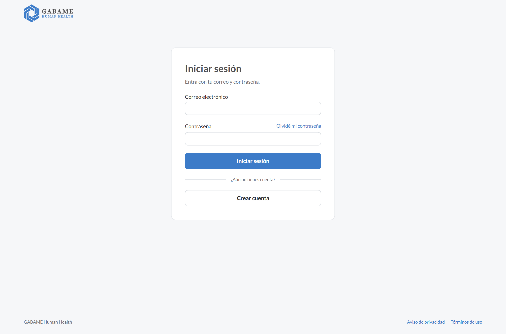

Escribe tu correo y tu contraseña. Tras varios intentos fallidos la cuenta se bloquea unos minutos.
La sesión se renueva sola mientras la uses y se cierra al salir.

### 2.2 Crear una cuenta

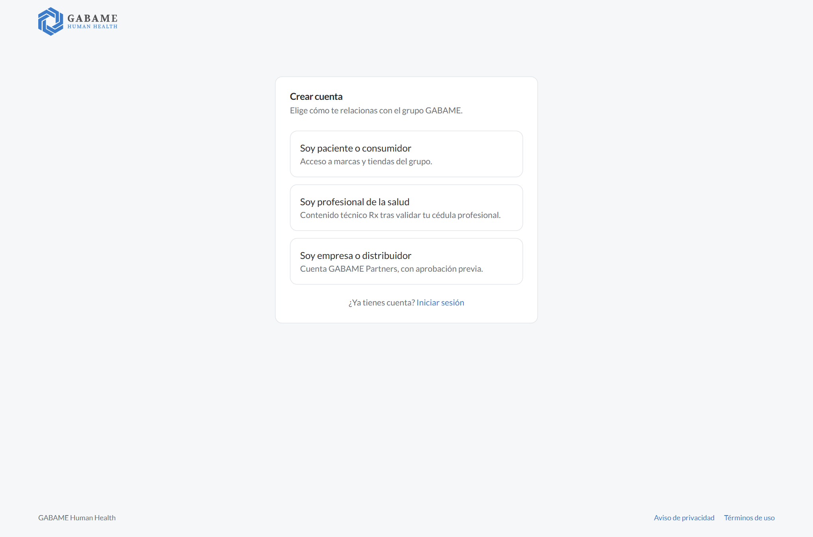

El registro pregunta primero **qué tipo de cuenta necesitas**, porque de eso depende lo que se te
pide y lo que verás después:

1. **Paciente o consumidor**: nombre, apellidos, correo y contraseña.
2. **Profesional de la salud**: además, tu cédula profesional, tu especialidad y tu institución.
   Tu cuenta queda en revisión hasta que el grupo valide la acreditación.
3. **Empresa**: razón social, RFC y con qué empresas del grupo quieres trabajar, indicando el tipo
   de relación en cada una. Cada empresa aprueba por su cuenta.

Después de registrarte recibirás un correo para **verificar tu dirección**. Hasta que lo hagas no
puedes entrar: es la forma de comprobar que el correo es tuyo.

### 2.3 Recuperar la contraseña

Desde "Olvidé mi contraseña" pides un enlace por correo. Al cambiarla se cierran las sesiones
abiertas.

## 3. Tu inicio

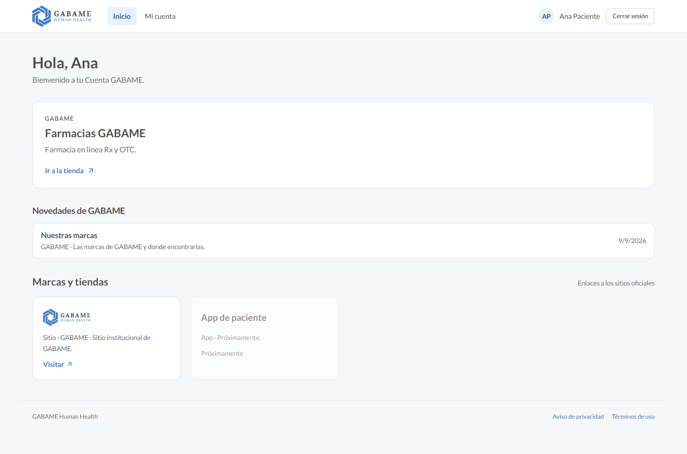

El inicio abre con **lo que esa persona viene a hacer**, y cambia según la cuenta:

- Un consumidor ve su tienda, con las promociones vigentes que haya.
- Un profesional de la salud ve su área médica y el estado de su acreditación.
- Una empresa ve sus vínculos y cuántos están aprobados.
- Quien administra ve sus colas de revisión con las cifras dentro.

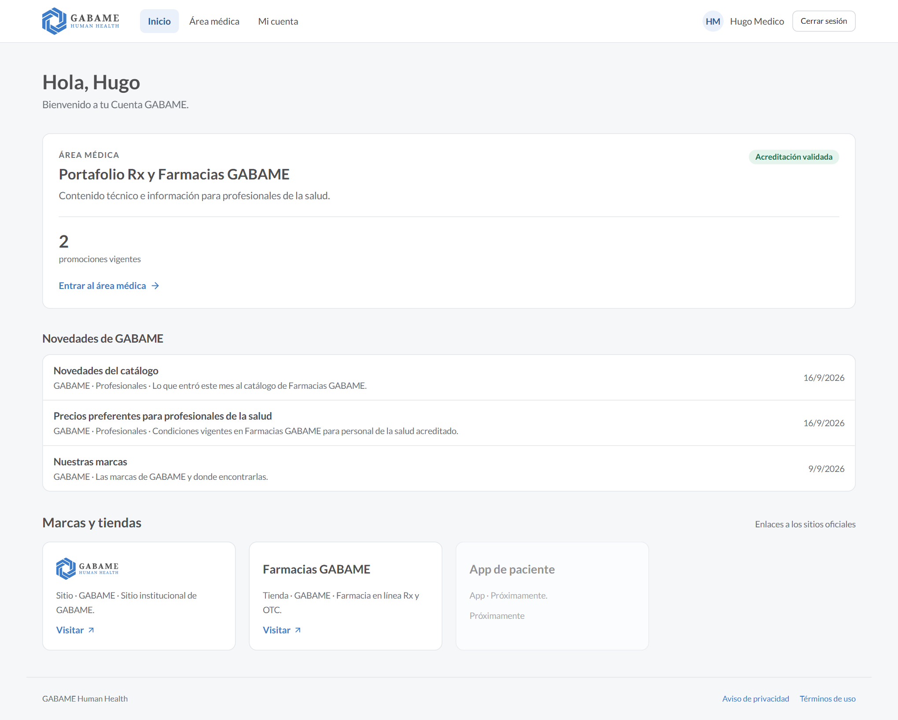

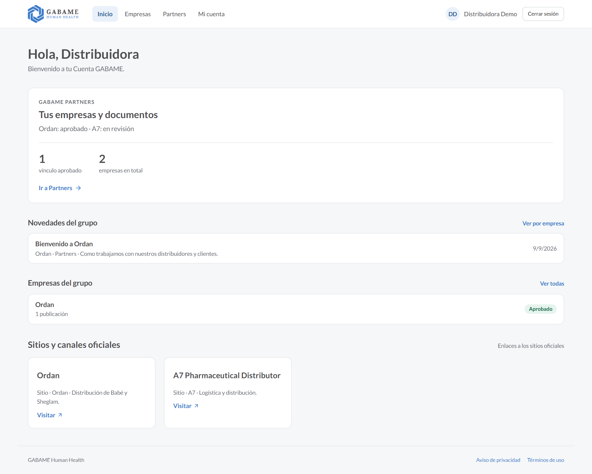

Debajo aparecen las **novedades**: lo que las empresas del grupo han publicado para esa persona,
lo más reciente primero. Al final, las **marcas y tiendas** a las que puede entrar.

## 4. Mi cuenta

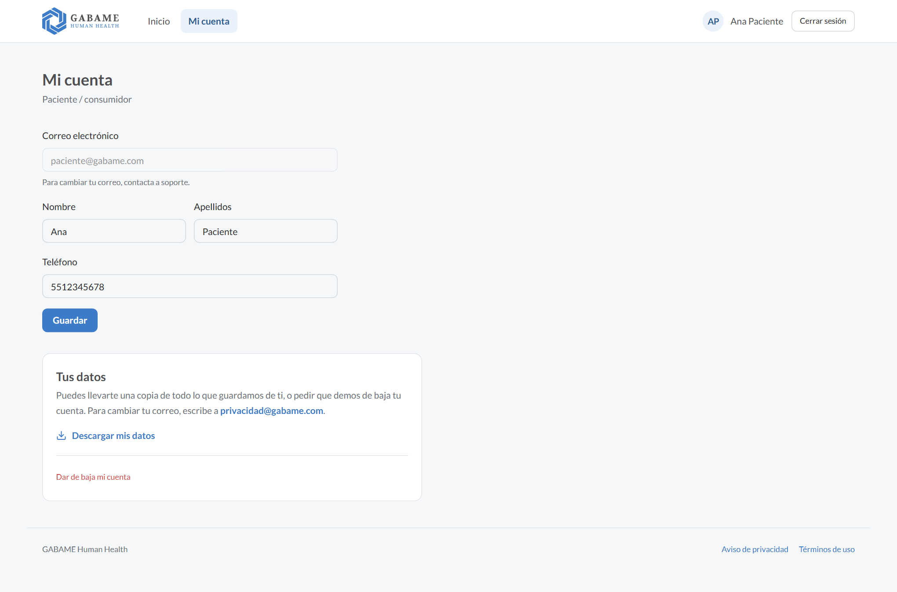

Aquí están tus datos personales: nombre, apellidos y teléfono. El correo no se cambia desde el
portal, porque es con lo que entras; para cambiarlo se escribe al contacto que aparece en pantalla.

En **Tus datos** puedes ejercer dos derechos sin pedirle permiso a nadie:

- **Descargar mis datos**: un archivo con todo lo que el portal guarda de ti.
- **Dar de baja mi cuenta**: tu acceso se cierra de inmediato y el grupo elimina la cuenta después
  de revisarla. Si cargaste documentos o tienes una relación comercial en curso, descarga antes tus
  datos.

## 5. Profesionales de la salud

### 5.1 Tu acreditación

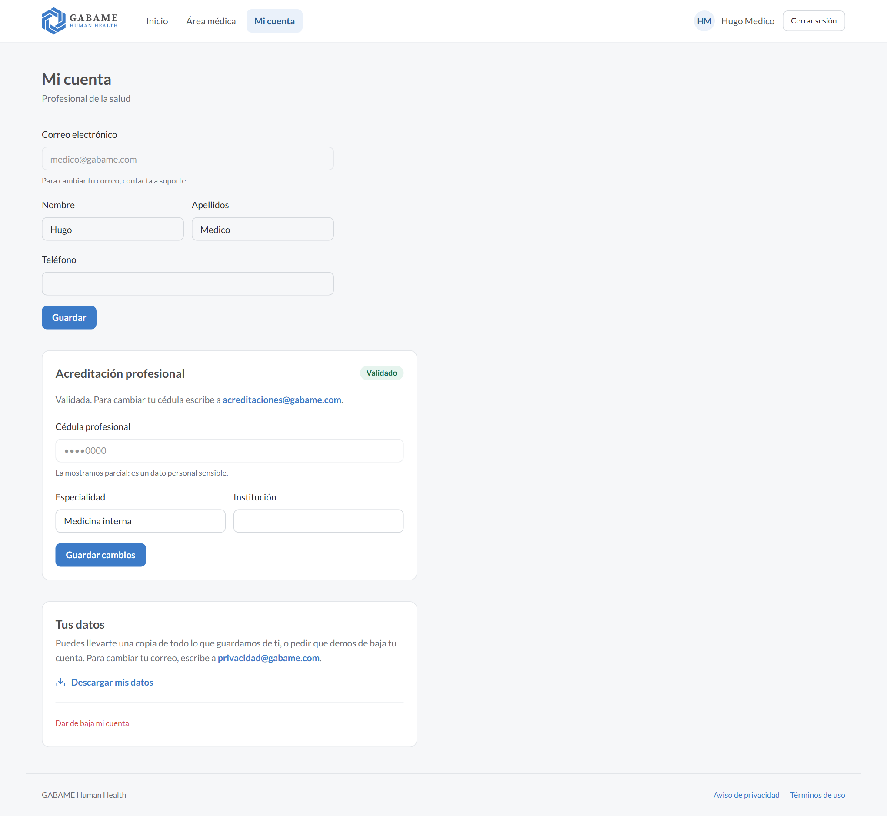

El acceso al contenido técnico no lo da el rol: lo da la **acreditación validada**. En Mi cuenta ves
en qué va:

- **En revisión**: desde cuándo espera y a quién escribir. Mientras tanto puedes corregir tus datos.
- **Validada**: la cédula se muestra parcial, porque es un dato personal sensible. Para cambiarla se
  escribe al grupo.
- **No aprobada**: aparece el motivo, corriges lo que haga falta y la vuelves a enviar a revisión.

### 5.2 Área médica

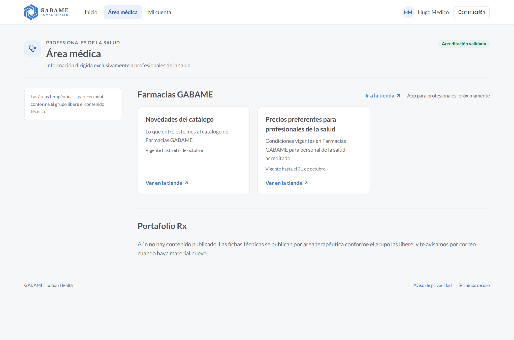

Abre con **Farmacias GABAME**: el salto a la tienda y las promociones vigentes para profesionales,
cada una con su fecha de fin. El botón a la app para profesionales aparecerá cuando la app exista.

Debajo está el **portafolio Rx**: las fichas técnicas por área terapéutica. Es contenido dirigido
exclusivamente a profesionales de la salud y hoy está vacío, a la espera del material del grupo.

## 6. Empresas y distribuidores

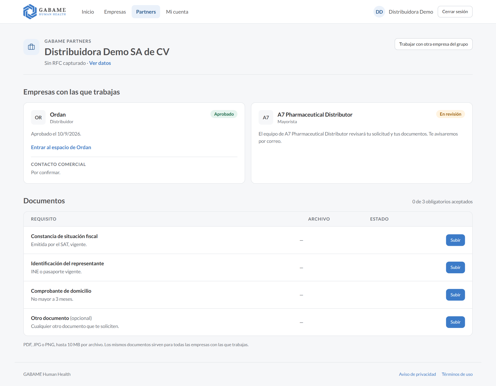

### 6.1 Tus empresas

Una tarjeta por cada empresa del grupo con la que trabajas, con su estado propio: puedes estar
aprobado con una y en revisión con otra. Cuando una te aprueba, aparecen su **contacto comercial** y
su **portal operativo**.

Si una empresa no aprueba tu solicitud verás el motivo y podrás **volver a solicitarla** cuando
corrijas lo que te pidieron. Desde "Trabajar con otra empresa del grupo" pides relación con otra.

### 6.2 Tus documentos

La tabla lista lo que se te pide, con el estado de cada archivo: pendiente, aceptado o rechazado (con
su motivo). **Los mismos documentos sirven para todas las empresas del grupo**: se cargan una vez.
Se aceptan PDF, JPG y PNG.

Tu razón social y tu RFC se corrigen en Mi cuenta mientras ninguna empresa haya aprobado tu vínculo;
después, esos son los datos aprobados y el cambio se trata con esa empresa.

### 6.3 El espacio de una empresa

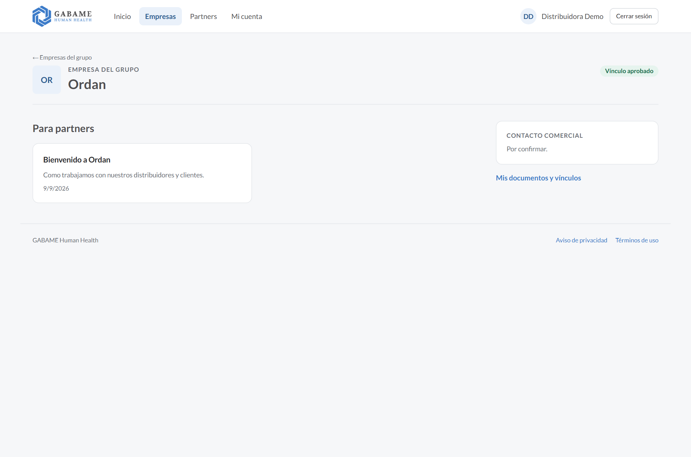

Cada empresa publica dentro de su espacio: lo que comparte contigo, su contacto y su portal
operativo, cuando tu vínculo está aprobado.

## 7. El panel de administración

### 7.1 Resumen

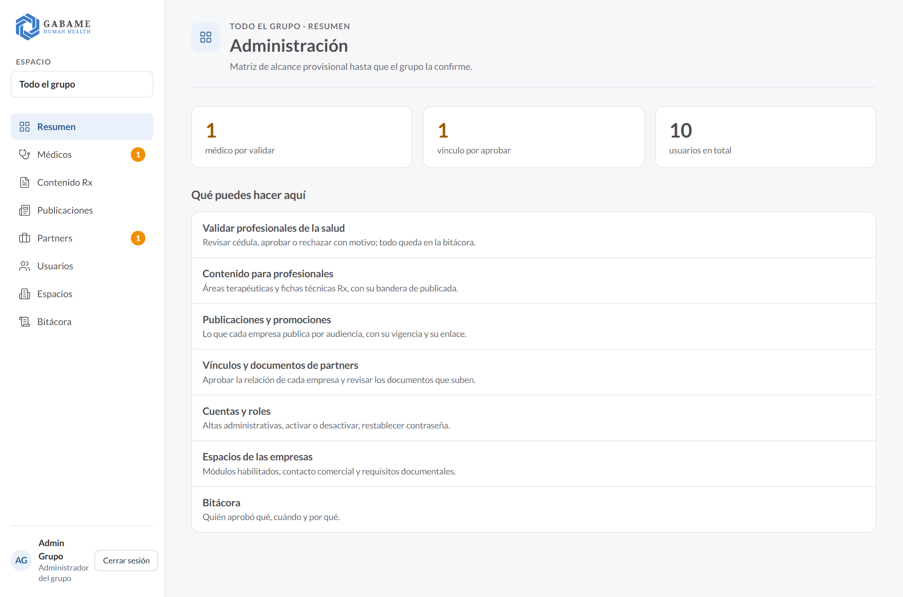

Abre con las cifras de lo que está esperando: médicos por validar, vínculos por aprobar y cuántas
cuentas hay en el alcance. Debajo, qué se puede hacer en cada sección.

Lo que cada quien ve depende de su alcance: un editor solo edita contenido y contactos de su
empresa; un administrador de empresa además aprueba y revisa cuentas; el administrador del grupo ve
las cuatro empresas.

### 7.2 Acreditaciones de médicos

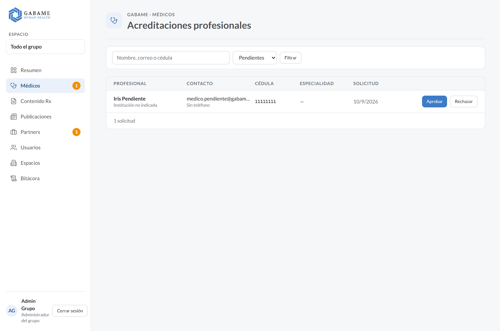

La cola de profesionales por validar, con su cédula, especialidad e institución. Se busca por
nombre, correo o cédula. Al aprobar o rechazar se pide el motivo y la persona recibe un correo;
todo queda en la bitácora.

### 7.3 Publicaciones y promociones

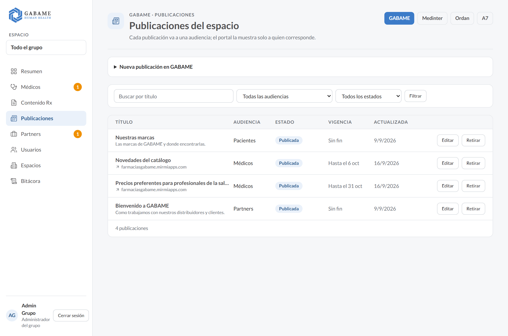

Cada publicación va a una audiencia —pacientes, profesionales de la salud o partners— y el portal la
muestra solo a quien corresponde. Una publicación se convierte en **promoción** cuando se le pone:

- **Vigente hasta**: el último día en que se muestra. Al pasar esa fecha deja de verse sola y queda
  marcada como "Vigencia terminada", para renovarla o retirarla.
- **Enlace**: adónde lleva. Solo se aceptan sitios y tiendas del grupo.

Se filtra por audiencia y por estado, y desde la misma fila se publica, se retira o se edita.

### 7.4 Partners y sus documentos

Las solicitudes de vínculo de cada empresa, con los documentos que cargó cada razón social. Se
aprueban o rechazan por empresa, no por cuenta: aprobar en Ordan no aprueba en A7.

### 7.5 Cuentas

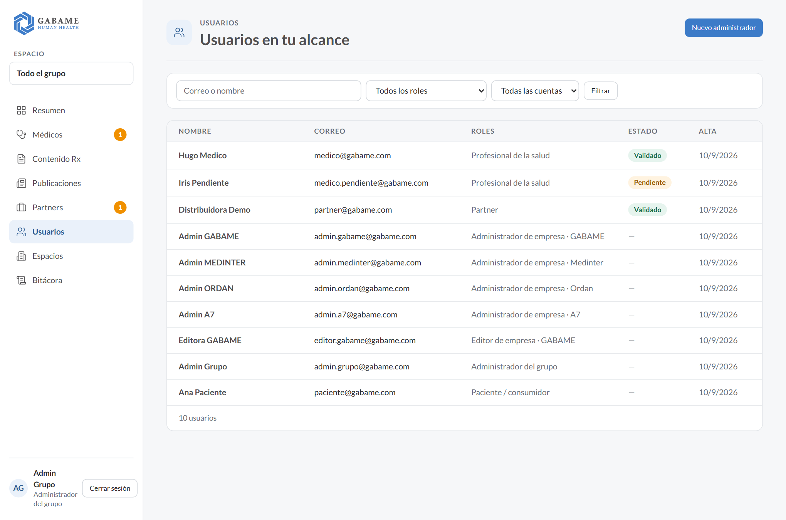

Las cuentas dentro del alcance, con búsqueda por correo o nombre y filtro por rol. Desde aquí se dan
de alta administradores y editores, se asignan roles, se activa o desactiva una cuenta y se envía un
enlace para restablecer contraseña. El filtro **Bajas solicitadas** muestra a quienes pidieron irse;
su cuenta se elimina desde su detalle.

### 7.6 Espacios

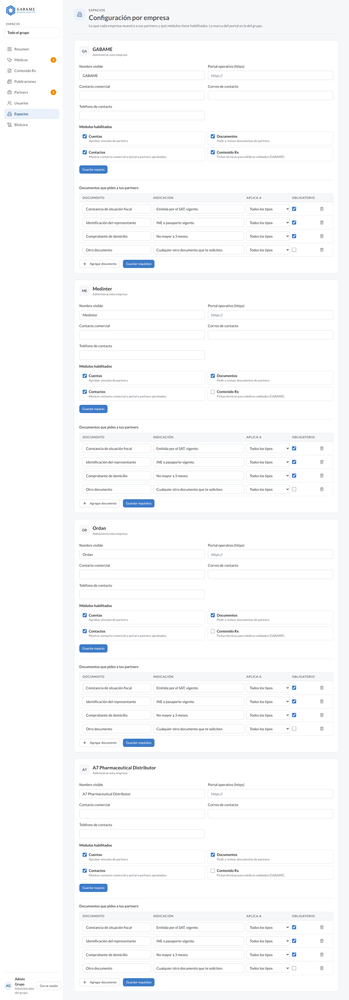

La configuración de cada empresa: qué módulos tiene habilitados, su contacto comercial, su portal
operativo y qué documentos pide a sus partners. Los módulos solo los cambia el administrador del
grupo.

### 7.7 Bitácora

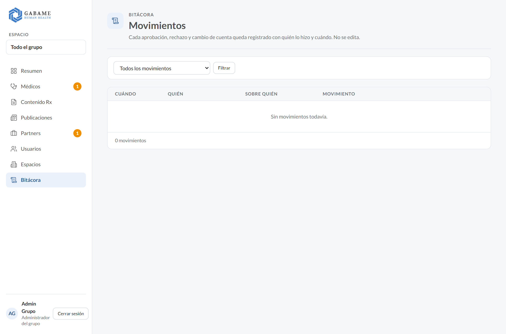

Quién hizo qué, sobre quién y cuándo. No se edita. Se filtra por tipo de movimiento:
acreditaciones, partners o cuentas.

## 8. En el celular

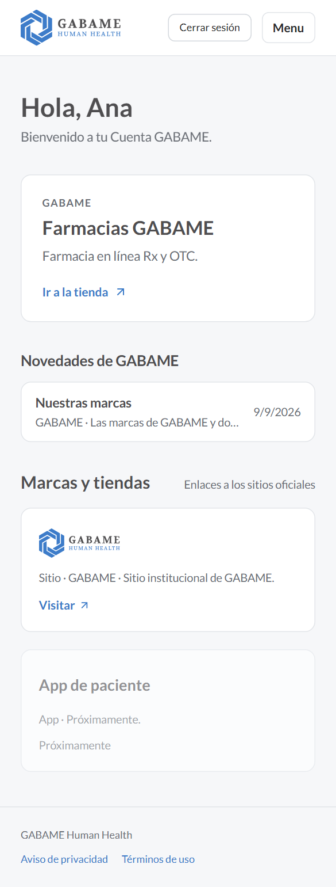

El portal se adapta al celular: el menú se abre con el botón de la esquina y las tarjetas y tablas
se apilan, cada dato con su etiqueta.

## 9. Reglas que conviene conocer

- Solo el administrador del grupo ve las cuatro empresas. Los demás ven aquellas con las que tienen
  relación.
- GABAME y Farmacias GABAME van juntas: la tienda es un producto de GABAME, no otra empresa.
- El acceso al contenido técnico lo da la acreditación validada, no el rol. Si se rechaza una
  acreditación, el acceso se cierra de inmediato.
- Cada empresa aprueba su propio vínculo con un partner, y los documentos se cargan una sola vez
  para todas.
- La cédula profesional se muestra parcial en pantalla y nunca aparece en enlaces.
- Toda aprobación, rechazo o cambio de cuenta queda en la bitácora, que no se edita.
- Desactivar una cuenta, cambiar la contraseña o dar de baja cierra las sesiones abiertas.
- El portal no guarda datos clínicos.

## 10. Lo que falta decidir el grupo

El portal está construido; lo que falta es contenido y criterio del grupo. Sin esto, algunas
pantallas se ven vacías en la demostración:

| Qué falta | A quién afecta | Hoy se ve así |
|---|---|---|
| **Qué hace el portal de cada empresa**: qué publica GABAME, Medinter, Ordan y A7, y para quién | Todos | Cada espacio tiene una publicación de ejemplo |
| Contenido técnico Rx: áreas terapéuticas y fichas | Profesionales de la salud | "Aún no hay contenido publicado" |
| Criterio para validar una acreditación | Profesionales de la salud | Aprobación manual desde el panel |
| Qué documentos pide cada empresa a sus partners | Empresas | Lista genérica de alta comercial |
| Contactos comerciales y portales operativos de cada empresa | Empresas | "Por confirmar" |
| Buzones del grupo: privacidad y acreditaciones | Todos | Direcciones provisionales |
| Aviso de privacidad y términos definitivos | Todos | Textos provisionales, marcados como tales |
| Dominio definitivo del portal y dirección final de Farmacias GABAME | Todos | Dominio de pruebas |

## 11. Lo que llegará después

- Que los sitios y tiendas del grupo usen esta cuenta para entrar (un solo acceso, sin registrarse
  de nuevo en cada tienda).
- La app para profesionales de la salud, con su botón dentro del área médica.
- Avisos por correo cuando se publique material nuevo.
